## Text Editors and IDEs

Text editors are applications that are used to write the source code. It comes with an user interface to write the code in it, and save it back at a location specified.

> Examples: *Vim, Neovim, Emacs, Nano, Sublime-Text, Notepad++, Brackets etc.,*

Integrated Development Environment (IDE) provides multiple tools like a text editor to write the source code, build automation tools to compile or build the program written, source code execution tool, debugger to inspect the errors, and many more features.

> Examples: *Visual Studio IDE, Visual Studio Code, Geany, Netbeans, Eclipse, IntelliJ, Pycharm, RStudio, etc.,*

Some of the text editors like *Vim* or *Sublime* can be extended to use it like an IDE, which will be much more lightweight on the system resources.

---

## Using VIM

VIM is an improved version of Vi text editor, highly configurable which makes the workflow efficient. To open a VIM instance enter **vim** at the prompt("$" or "#") in a terminal (assuming that VIM is installed on your system).

### Installing & Verifying VIM
To install **VIM** on *Ubuntu* or *Ubuntu* based distros (operating systems) like *Mint*, or *Windows Subsystem for Linux*, please use the following command:

```terminal
$sudo apt-get install vim
```

More on **apt-get** [click here](http://manpages.ubuntu.com/manpages/xenial/man8/apt-get.8.html), or go to **man apt-get** through terminal.

To install **VIM** on *Arch Linux* based distros (operating systems) like *Manjaro*, use the following command:

```terminal
$sudo pacman -S vim
```

More about pacman [click here](https://www.archlinux.org/pacman/pacman.8.html), or go to **man pacman** through the terminal.

To verify **VIM** installation:
```terminal
$vim
```
which opens up a vim editor like this:

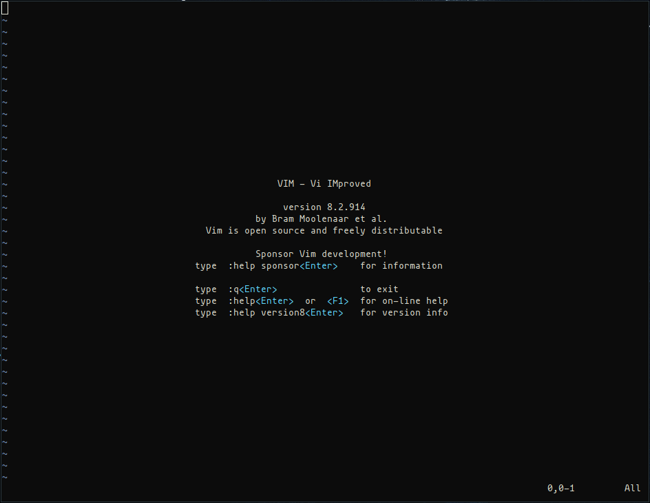

### How to Navigate in VIM.
To move around in VIM, across the lines, or from left to right, or vice versa use the following keys in the **NORMAL** mode.

- **j** - down
- **k** - up
- **h** - left
- **l** - right

Similar to the arrow keys:

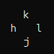

### Four Major VIM modes:

- Normal Mode
- Insert Mode
- Visual Mode
- Replace Mode

1. **Normal Mode:**
In this mode we can use VIM editor commands by pressing **":"**. One can move around the editor while being in this mode.

2. **Insert Mode:**
To get into insert mode press **i** in Normal Mode, and *--INSERT--* will be displayed at the bottom of the editor. Only through this mode a user can write the something in VIM. To quit out of the insert mode press **"ESC"** key.

    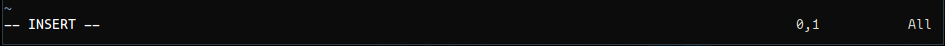

3. **Visual Mode:**
This mode is used to highlight an area of code, which can be later copied or modified. To use this mode press **"v"** while in Normal mode, and it dispays *--VISUAL--* at the bottom.
Visual line mode highlights the lines, press **"SHIFT+V"**. It displays *--VISUAL LINE--* at the bottom.
Visual block mode highlights blockwise, press **"CTRL+V"**. It displays *--VISUAL BLOCK--*.

    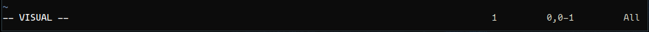

4. **Replace Mode:**
This is a special kind of insert mode, where it deletes the characters under the cursor, and replaces whatever we enter. To enter into replace mode press **"SHIFT+R"**. It displays *--REPLACE--* at the bottom of the editor.

    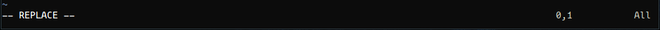

**NOTE:** To exit any mode and return to NORMAL mode press **"ESC"**.

5. **Command-Line Mode:**
This is where one enters the commands. To enter this mode simply press **colon(:)**.

    

- **:w** - saves the appended text or modified text into the file
- **:q** - quits the VIM text editor
- **:q!** - discards the changes made, and quits the VIM text editor
- **:wq** - saves the changes and quits the VIM text editor
- **:50** - jumps to the specified line number i.e. 50 here
- **:his** - lists out the history of commands that was used previously

#### Search Pattern and Replace Commands:

- **/search-pattern** - searches for the pattern passed after **"/"**
- **:%s/search-pattern/replacement** - searches for the *search-pattern*, and replaces all the instances of it with *replacement* string.
- **:%s/search-pattern/replacement/gc** - matches the *search-pattern*, starts replacing it with a *replacement* pattern, and asks for confirmation at every instance of the search-pattern found.

#### Operators:
The operators are used to manipulate the code or the text. Use these commands in NORMAL mode.
- **d** - delete the highlighed area
- **y** - yank or copy the highlighted area
- **p** - paste the last deleted area or the yanked code after the cursor
- **r** - replace a character under the cursor
- **u** - undo the last modification

#### Motion Operators:
It provides context to the operators, or the cursor jumps multiple words or to the EOF. These can be combined with the above operators.
- **w** - jumps to the first character or the start of next word
- **e** - jumps to the last character or the ending of next word
- **b** - jumps to the beginning of previous word
- **$** - jumps to the end of line
- **0** - jumps to the beginning of a line
- **gg** - jumps to the beginning of the file
- **G** - jumps to the end of the file
- **}** - jumps to beginning of next paragraph
- **{** - jumps to end of the paragraph

    Deleting a word:
    - **dw** - deletes a word starting from the cursor until the next word
    - **de** - deletes a word starting from the cursor until the end of the word
    - **d5w** - deletes 5 words starting from the cursor
    - **d4b** - deletes 4 previous words starting from the cursor
    - **d$** - deletes the words from the cursor until the line ends
    - **d3$** - deletes 3 lines after the cursor position.

#### Search & Highlight patterns
- **/word_to_be_highlighted** - highlights all the words or patterns matching *word_to_be_highlighted* string
- **n** - to move to the next search match
- **N** - to move to the previous search match
- **:noh** - is used to clear the last search pattern highlighting

**NOTE:**
- For further help use **":help"** command in VIM, it brings up the manual for VIM.

    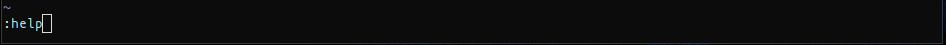

    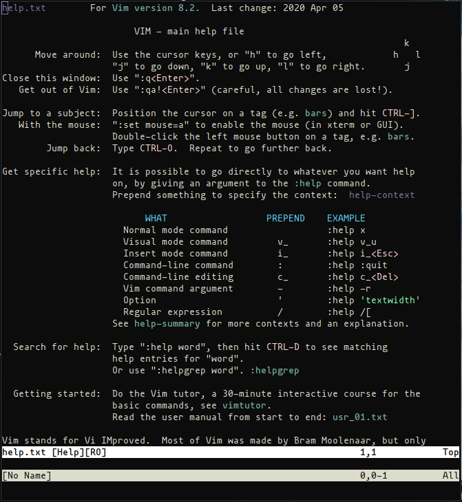

- For practicing how to use VIM, please refer to the **vimtutor** section in the VIM manual.
    In the above page, place your cursor on **vimtutor** highlighted in blue color, and then press **CTRL+]**, which opens up the vim tutorial:

    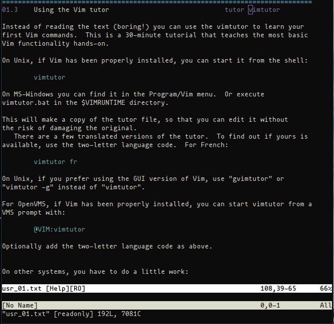

    Follow the instructions, and learn how to use VIM effectively.

---

## Writing a Bash Script

Bash script is a file containing bash commands, which will be executed through the command line, or at the time of a particular event being triggered.

### How to write a bash script

1. Firstly, we need bash, make sure it is installed on your systems. You can verify it by entering  **"bash --help"** on your terminal.

    **NOTE:** Windows users need to install *Windows Subsystem for Linux*, here is the link - **[click here](https://docs.microsoft.com/en-us/windows/wsl/install-win10)**

2. Next we need an editor like *VIM* or *Sublime-Text* (any text editor would suffice). Open the text editor by using the following command with the file name:
    ```terminal
    $vim hello.sh
    ```

    In here **hello.sh** is the filename with an extension **.sh**.

3. The file will be opened in VIM, you can write a bash script similar to the following code:

    ```bash
    #!/bin/bash                     # this is shebang
    echo "Hello, $(whoami)!"        # display message
    ```

    - Here, the first line is called **shebang**, that indicates it is a bash script, which will be recognized by the bash interpreter at the execution time.
    - In the second line, **"echo"** command is similar to print statement, that reproduces the specified output.
    - **#** indicates the **commented line** for better understanding of what a particular statement does.

1.  After the above step, save the file with the following command that is to be executed inside VIM in the NORMAL mode:

    ```vim
    :wq
    ```

    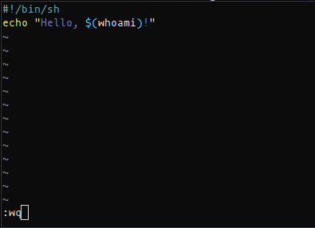

    Here, the command **:wq** is used in the vim to save and exit the file.

2. Now, make this bash script *hello.sh* executable:

    ```terminal
    $chmod +x hello.sh
    ```
    In here, **chmod** command makes the file **hello.sh** executable by using the option: **+x**.

    **chmod** command is used to give or retrieve permissions to any file on linux systems. For more information please refer to **man chmod** at the prompt.

3. Finally, we can execute this bash script using the following command:

    ```terminal
    $./hello.sh
    ```

    or use **bash** command:

    ```terminal
    $bash hello.sh
    ```

    - **"./"** or **"bash"** command specifies the bash interpreter to execute *hello.sh*

    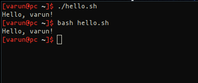

---

### Bash Script to Retrieve Data About India's Current COVID-19 Cases

You can follow the above steps to write the following bash script and save it with a filename similar to *corona_india.sh*

```bash
#!/bin/sh
curl -s https://corona-stats.online/india > ~/.cache/corona             # curl retrieves the data from the API & stores it in ~/.cache/corona
grep "India" ~/.cache/corona |                                          # grep matches the pattern "India" in the file ~/.cache/corona
    sed "s/\s//g ; s/║/;/g; s/│/;/g" |                        # sed filters or removes the whitespaces, | symbols from the grep command
    awk -F';' '{print "Total cases: " $4 " | Deaths: " $6 " | Active cases: "$9""}'     # awk prints the data in a formatted manner.
```

1. In first line we're using **curl** command to retrieve data from the API https://corona-stats.online/india and then stores it in the file *~/.cache/corona*

    **NOTE:** You can use any path to save the data, be it on your root directory or your home directory, instead of *~/.cache/*

    ```bash
    curl -s https://corona-stats.online/india > ~/.cache/corona
    ...
    ```
    - **">"** redirects the output of **curl** command to the file *~/.cache/corona*

    This is how the curl command retrieves the data if you run it at the prompt:

    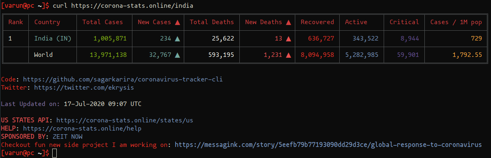

2. In the second line, **grep** command is used to retrieve only the record containing India's stats on COVID-19:

    ```bash
    ...
    grep "India" ~/.cache/corona |
    ...
    ```
    - Here, we're retrieving data that is stored in the file *~/.cache/corona*
    - At the end piping **"|"** symbol is used which just combines multiple commands, or simply redirects the standard output of one command to another
    - So, the grep command is redirected to the following commands after **"|"**

    Here, you can see how **grep** command retrives only the stats about India's COVID-19 data:
        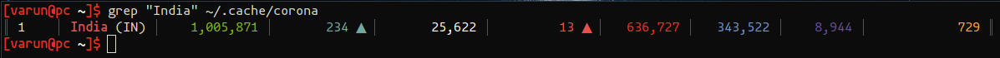

3. The third line contains the **sed** command that filters out or removes unwanted characters:

    ```bash
    ...
    sed "s/\s//g ; s/║/;/g; s/│/;/g" |
    ...
    ```

    - Here **"s/"** is used to replace or substitue the following
    - next **"\s"** refers to the whitespaces, that will be removed
    - **"//g"** is to specify that it has to removes all the whitespaces i.e. globally
    - **";"** is the delimiter that replaces the whitespaces or the piping(|) symbols that are seen in the previous **grep** command
    - Similarly after the first **";"**, we're removing **"||"** and substituting it with **";"**
    - At last **"|"** is being substituted again with **";"**
    - Finally we pass the whole filter that is inside the double quotes("...") to the next command using the piping symbol **|**

    This is how sed command replaces those characters with **";"**

    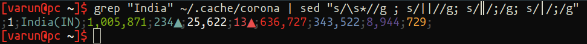

4. Finally, awk command is used to format the output with only the required data to be printed:

    ```bash
    ...
    awk -F';' '{print "Total cases: " $4 " | Deaths: " $6 " | Active cases: "$9""}'
    ...
    ```

    - Here **"-F"** acts as a separator which recognises the delimiter **";"** from the previous **sed** command, and only grabs the data fields that are specified in this **awk** command
    - **"$4"** grabs the 4th data field, the first data field being before the first semicolon(**;**)

    Here's the final output of the whole script:

    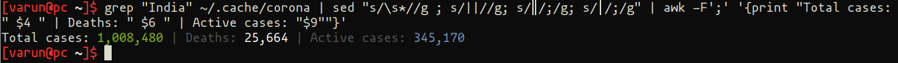

5. One can run this *corona_india.sh* bash script , similar to the previous script being executed after making it executable:

    ```terminal
    $chmod +x corona.sh
    $./corona.sh
    ```

    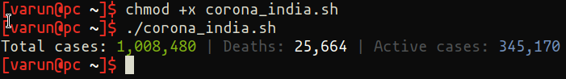

---

## Writing a C File and Executing it Using GCC Compiler

To write a C file we can use the same **VIM text editor**, compile the program, and then finally execute it on the teminal.

### Here's a Palindrome Program in C:

```c
#include <stdio.h>
#include <string.h>

// this is the main function
int main(){
    char input_string[100]; //initialising an array of size 100
    int i, length; // initialising two integer variables -> a and length
    int flag = 0; // initialising an integer flag to 0

    printf("Enter a string: "); // printing this string on the screen
    scanf("%s", input_string); // we read the input from the screen

    length = strlen(input_string); // length of the array

    // looping over the length of the array
    for(i=0;i < length ;i++){
    // checking if the ith char and its correspding character from the string's right side are not the same.
    // For example, if the input string is `bangalore`, length of bangalore is 9
    // if i=0 -> bangalore[0] is `b` and bangalore[length-i-1] = bangalore[9-0-1] = bangalore[8] = bangalore[8] is `e`.
    // since bangalore[0] -> `b` is not equal to bangalore[8] -> `e`, the flag will be set to 1 and breaks out of the loop.
        if(input_string[i] != input_string[length-i-1]){
        // setting flag to 1
            flag = 1;
        // break out of the loop
            break;
    }
    }
    // if flag is 1, we know it from the previous loop that its not a palindrome
    if (flag) {
        printf("%s is not a palindrome\n", input_string);
    }
    // else if flag is 0, print that the input string is a palindrome
    else {
        printf("%s is a palindrome\n", input_string);
    }
    return 0;
}
```

**NOTE:** The lines or statements after **"//"** are comments that is for understanding what that particular statement does, and won't be executed by the compiler.

1. First two lines being the header files:
    ```c
    #include <stdio.h>
    #include <string.h>
    ...
    ```
    - **stdio.h** contains definition for input and output operations like **printf** and **scanf**
    - **string.h** contains some string methods like **strlen()**

2. Next comes the **main()** function being the first function that the compiler searches for, before any other function:

    ```c
    ...
    int main() {
    ...
    }
    ```
    Here, we're specifying the main() function to return integer value

3. Initializing and declaring variables or arrays:

    ```c
    ...
    char input_string[100];
    int i, length;
    int flag = 0;
    ...
    ```
    - **char** datatype is used to declare the **input_string[100]** of the type character, and the array length being 100
    - **int** datatype is used to declare the variables **i** and **length** that will be used in the following lines of code
    - **flag** is intialized to 0, acts like a **boolean values (true or false)**, here we'll be using **0** and **1** to determine the condition that we'll be testing

4. A prompt to accept an input string:

    ```c
    ...
    printf("Enter a string:");
    scanf("%s", input_string);
    length = strlen(input_string);
    ...
    ```
    - first statement prints a message on the screen
    - **scanf** accepts the input from the user, **"%s"** specifies the input as a string, and stores it in the array **input_string**
    - then determine the length of the array using the **strlen()** function, and assign the value to the variable **length**
    - *for ex:* **input_string = madam**, the **length = 5**

5. for loop to iterate through the characters of input_string array:
    ```c
    ...
    for(i=0; i < length; i++)
    {
        ...
        ...
    }
    ...
    ```

    - **for loop** is used to iterate through the array **input_string** which contains the input accepted from the user.
    - for loop syntax: **for(intialization; test-condition; updation)**
    - *for ex:* **input_array = madam**, each of the character in the string **madam** is given an index postion, which starts from 0.
    - characters assigned with the index positions: **m = 0, a = 1, d = 2, a = 3, m = 4**
    - hence, we the intialization starts with **i = 0**
    - and it loops until it reaches last index position 4 being the character **"m"**.
    - **i++** increments with 1 at each loop.
    - when the value of **i** increments to 6 (i = 6), the condition **i < length** fails, because **i** is not less than the variable **length** (length = 5).

6. Logic to test the given string is palindrome or not:
    ```c
    ...
    if(input_string[i] != input_string[length-i-1])
    {
        flag = 1;
        break;
    ...
    ```
    - this logic works inside the for loop, at each iteration, i.e, for every character of the **input_string** array.
    - *for ex:* if(madam[0] != madam[5-0-1]) -> if(m != m)
    - which fails the test condition, and the flag statement won't be executed.
    - and loops until the if condition satisfies, in this example, for madam array, it never sets the flag to 1.
    - Hence, the flag will always be set to 0 in this madam example.
    - *for ex:* input_string = bangalore
    - then, if(bangalore[0] != bangalore[9-0-1] -> if(b != e)
    - in this example the test condition is satisftied at the first iteration itself.
    - Now, the flag will be set to 1, i.e, **flag = 1** statement inside the if condition is executed.
    - Next statement being **break**, breaks out of the **for loop**, and jumps straight to the very next statements outside the for loop.

7. Display message to inform the user if the **input_string** is palindrome or not:
    ```c
    ...
    if (flag)
    {
         printf("%s is not a palindrome\n", input_string);
     }
     else
     {
         printf("%s is a palindrome\n", input_string);
     }
     return 0;
    ...
    ```
    - from the previous test condition the **flag = 0**, in **input_string = madam** example
    - then the compiler prints the **else part**, i.e., *"madam is a palindrome"*
    - when the **input_string = bangalore**, the flag was set to be 1 (i.e. flag = 1)
    - then the compiler prints the **if part**, i.e, *"bangalore is not a palindrome"*

### Steps to Compile & Execute the C Program

For compiling the C program we need a compiler like **GCC Compiler** on linux.
Test if it has been installed by using the following command:

```terminal
$gcc --version
```

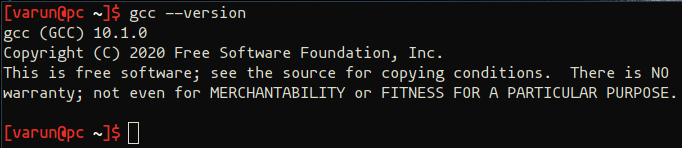

1. First step is to compile the above written palindrome C program:
    ```terminal
    $gcc palindrome.c -o palindrome.o
    ```
    - Here, **palindrome.c** is the C file, and **gcc** command is used for compilation
    - we're passing the compiled output to be stored in a **object file or binary file** called **palindrome.o**
    - the above step of outputing the compiled program is done by passing the option **"-o"**

2. In the second step use the **object file** created i.e., **palindrome.o** to execute the compiled program:
    ```terminal
    $./palindrome.o
    ```
    Here **"./"** is prefixed to the object code file to run it

    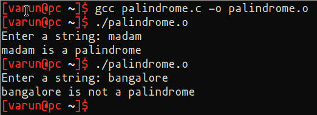

---

